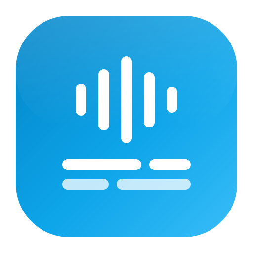
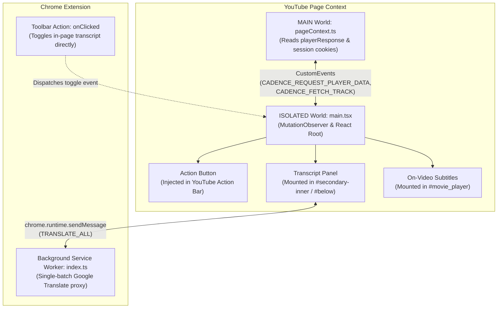

#  Cadence — YouTube Transcript & Bilingual Subtitles

<p align="center">
  <em>Instant YouTube transcript extraction, zero-config bilingual translation, interactive playback seeking, and full-text search directly inside YouTube.</em>
</p>

<p align="center">
  <a href="#key-features"></a>
  <a href="#tech-stack"></a>
  <a href="#tech-stack"></a>
  <a href="#tech-stack"></a>
  <a href="LICENSE"></a>
</p>

<p align="center">
  <a href="https://github.com/ichshakib/cadence/releases/download/v1.0.0/cadence-1.0.0.zip">
    
  </a>
  &nbsp;&nbsp;
  <a href="https://ichshakib.github.io/cadence/">
    
  </a>
  &nbsp;&nbsp;
  <a href="https://github.com/ichshakib/cadence">
    
  </a>
</p>

> Maintained by [Shakib Khan (`@ichshakib`)](https://github.com/ichshakib)

---

## Table of Contents

- [Overview](#overview)
- [Key Features](#key-features)
- [How It Works](#how-it-works)
- [Project Architecture](#project-architecture)
- [Tech Stack](#tech-stack)
- [Installation & Setup](#installation--setup)
  - [Quick Install (Unpacked Extension)](#-quick-install-unpacked-extension)
  - [From Source (Production Build)](#from-source-production-build)
  - [Development Mode (HMR)](#development-mode-hmr)
  - [Standalone Showcase Website](#standalone-showcase-website)
- [Usage Guide](#usage-guide)
  - [In-Page Transcript Button](#in-page-transcript-button)
  - [Bilingual Dual-Language Subtitles](#bilingual-dual-language-subtitles)
  - [Playback Seeking & Auto-Scroll](#playback-seeking--auto-scroll)
  - [Full-Text Search](#full-text-search)
  - [Custom File Upload & Paste](#custom-file-upload--paste)
- [Available Scripts](#available-scripts)
- [Troubleshooting](#troubleshooting)
- [Contributing](#contributing)
- [Code of Conduct](#code-of-conduct)
- [Contact](#contact)
- [License](#license)

---

## Overview

**Cadence** is an open-source Chrome extension and interactive web application designed to elevate your YouTube video learning, language study, research, and subtitle reading experience.

Unlike conventional tools that require switching tabs, copy-pasting URLs, or clicking through clunky native YouTube menus, Cadence injects a dedicated **"Transcript"** button directly into YouTube's action bar (between Like/Dislike and Share). With a single click, users can view synchronized transcripts, toggle **dual-language bilingual subtitles** in over 20 languages, search through dialogues in milliseconds, and jump playback to any timestamp.

Operating entirely client-side, Cadence interfaces with YouTube's player response data without simulating button clicks, ensuring seamless, zero-flicker performance.

---

## Key Features

### 🎬 Native YouTube In-Page Button
- Injects a seamless **"Transcript"** button right beside Like/Dislike and Share.
- Automatically handles YouTube SPA navigation (`yt-navigate-finish`, `popstate`) without requiring full page refreshes.
- Positions the transcript panel at the top of the right column (`#secondary-inner`) or directly below the player on mobile and theater mode.

### 📺 On-Video Player Subtitle Overlay
- Display synchronized bilingual subtitles directly on top of the YouTube video player.
- Operates seamlessly across normal view, theater mode, and full-screen playback.
- Automatically adjusts its position when YouTube playback controls auto-hide during video playback.
- Click-through transparency (`pointer-events: none`) ensures pause/play and seeking remain 100% responsive.
- One-click toggle from the transcript panel header.

### 🌐 Bilingual Dual Subtitles
- Displays the speaker's original spoken line alongside your translated language in stacked, synchronized rows.
- Zero-config batch translation: translates entire video transcripts in a single network round-trip via Google Translate's GTX API, avoiding rate limits and stutter.
- Supports on-device Chrome AI translator fallback where available.

### ⏱️ Playback Synchronization & Timestamp Seeking
- Automatically highlights the active dialogue line as the video plays.
- Auto-scroll keeps the current line visible without losing your place.
- Click any timestamp to immediately jump the video playback (`video.currentTime`) to that exact moment.

### 🔍 Full-Text Dialogue Search
- Filter through hundreds of lines in milliseconds.
- Searches both the original spoken transcript and translated text simultaneously.
- Highlights matching keywords in real time.

### 📂 Universal Multi-Format Import & Export
- If a video lacks closed captions, drag & drop your own files:
  - **SRT** (`.srt`)
  - **WebVTT** (`.vtt`)
  - **JSON** / TimedText format
  - Plain timestamped text or direct copy-paste from any source
- One-click export copies clean, formatted bilingual transcripts to your clipboard.

### 🌓 Adaptive YouTube Theme Matching
- Observes YouTube's light and dark mode changes in real time.
- Uses native YouTube color tokens for seamless visual harmony.

---

## How It Works



1. **MAIN World Bridge:** `pageContext.ts` executes in YouTube's MAIN world to read `ytInitialPlayerResponse` and fetch `timedtext` tracks using the user's active session.
2. **Event Communication:** CustomEvents safely bridge the extracted caption tracks into the isolated content script.
3. **Reactive UI:** React 19 renders the action button and transcript panel using native YouTube styling.
4. **Batch Translation:** When bilingual subtitles are enabled, the background service worker batches segments into a single HTTP POST request, returning instant dual-row translations.

---

## Project Architecture

```text
cadence/
├── chrome-extension/              # Manifest V3 Chrome Extension
│   ├── src/
│   │   ├── background/            # Background service worker (batch translation proxy)
│   │   ├── content/               # Content scripts & in-page UI
│   │   │   ├── hooks/             # YouTube theme observer (useYouTubeTheme)
│   │   │   ├── views/             # React views (App, Transcript, TranscriptActionButton, VideoOverlay)
│   │   │   ├── main.tsx           # Content script entry point & DOM injection logic
│   │   │   ├── pageContext.ts     # MAIN world script (interfacing with ytInitialPlayerResponse)
│   │   │   ├── panelState.ts      # Shared visibility state between button & panel
│   │   │   ├── transcriptService.ts # Extraction, SRT/VTT parser, and translation pipeline
│   │   │   └── types.ts           # Shared TypeScript interfaces
│   │   ├── popup/                 # Browser toolbar action popup
│   │   └── sidepanel/             # Chrome side panel companion UI
│   ├── public/
│   │   ├── icons/                 # Extension icons (16, 32, 48, 128 px)
│   │   └── logo.svg               # Official Cadence vector logo
│   ├── manifest.config.ts         # Chrome Manifest V3 configuration (@crxjs/vite-plugin)
│   ├── vite.config.ts             # Vite build & CRX packaging configuration
│   └── package.json               # Extension dependencies and scripts
├── assets/                        # Official landing page assets
│   ├── css/style.css              # Landing page styling
│   ├── js/main.js                 # Landing page interactive transcript simulator
│   └── images/                    # Landing page media & favicon_io set
├── index.html                     # Standalone official landing page
├── .github/                       # CI/CD workflows and issue/PR templates
├── CODE_OF_CONDUCT.md             # Community standards
├── CONTRIBUTING.md                # Contribution guidelines
├── LICENSE                        # MIT License
└── README.md                      # Project documentation
```

---

## Tech Stack

| Layer | Technology | Purpose |
| :--- | :--- | :--- |
| **Framework** | [React 19](https://react.dev/) | High-performance reactive UI for panel and buttons |
| **Language** | [TypeScript 5.9](https://www.typescriptlang.org/) | Strict type safety and maintainable codebase |
| **Bundler** | [Vite 8](https://vitejs.dev/) + [@crxjs/vite-plugin](https://crxjs.dev/) | HMR development and Manifest V3 compilation |
| **Packaging** | `vite-plugin-zip-pack` | Automated ZIP packaging for releases |
| **Icons** | [Lucide React](https://lucide.dev/) | Modern, clean iconography |
| **Styling** | Pure Vanilla CSS | Maximum performance, zero framework bloat, YouTube theme matching |

---

## Installation & Setup

### 📦 Quick Install (Unpacked Extension)

1. Download the [cadence-1.0.0.zip](https://github.com/ichshakib/cadence/releases/download/v1.0.0/cadence-1.0.0.zip) archive directly or visit [Releases](https://github.com/ichshakib/cadence/releases).
2. Unpack the zip file (or point to `chrome-extension/dist`).
3. Open Google Chrome and navigate to `chrome://extensions/`.
4. Enable **"Developer mode"** in the top-right corner.
5. Click **"Load unpacked"** and select the unpacked folder.
6. Open any YouTube video and enjoy Cadence!

### 🛠️ From Source (Production Build)

```bash
# 1. Clone repository
git clone https://github.com/ichshakib/cadence.git
cd cadence/chrome-extension

# 2. Install dependencies
pnpm install

# 3. Build for production
pnpm build
```

The compiled extension will be in `chrome-extension/dist/`, and a packaged release archive will be created in `chrome-extension/release/`.

### ⚡ Development Mode (HMR)

```bash
cd cadence/chrome-extension
pnpm dev
```

Vite will watch for changes and update your loaded unpacked extension with Hot Module Replacement.

### 🌐 Standalone Showcase Website

Cadence includes an official showcase landing page with an interactive transcript simulator:

```bash
# Serve from repository root
cd cadence
python -m http.server 3000
```

Open `http://localhost:3000/` in your browser to test the interactive demo.

---

## Usage Guide

### In-Page Transcript Button
When viewing any YouTube video, look directly under the video title next to the Like/Dislike and Share buttons. Click **"Transcript"** to open the Cadence panel. You can also click the Cadence toolbar icon to toggle the panel on any YouTube page.

### On-Video Player Subtitle Overlay
Click the **Subtitles** icon button in the transcript panel header to toggle subtitles directly on the YouTube video player. When enabled, subtitles stay synchronized with speech and automatically adjust for player controls and fullscreen mode.

### Bilingual Dual-Language Subtitles
1. In the panel header, select your desired target translation language from the dropdown.
2. Click the **Languages** icon button.
3. Cadence instantly translates all lines and displays original + translated sentences in stacked rows with arrow markers (`↳`).

### Playback Seeking & Auto-Scroll
- Click on any timestamp (e.g. `01:42`) to jump the video directly to that moment.
- The active subtitle line is highlighted in real time as the video plays.
- Toggle the auto-scroll icon button if you wish to freely scroll through the transcript without being repositioned.

### Full-Text Search
- Type into the search input to filter dialogue lines in real time.
- Matches are highlighted across both the original transcript and translated text.

### Custom File Upload & Paste
If a video doesn't have closed captions:
- Drag and drop an `.srt`, `.vtt`, or `.json` file directly into the Cadence dropzone.
- Or click **"Paste"** to paste copied timestamp lines or raw dialogue text.

---

## Available Scripts

In the `chrome-extension/` directory:

| Command | Action |
| :--- | :--- |
| `pnpm dev` | Starts Vite development server with HMR. |
| `pnpm build` | Compiles TypeScript and builds production extension bundle into `dist/`. |
| `pnpm preview` | Serves the production build preview. |

---

## Troubleshooting

<details>
<summary><strong>Subtitles not loading for a video?</strong></summary>

Some creators disable closed captions entirely. In this case, Cadence will clearly display a notice. You can drag and drop your own subtitle file (`.srt` or `.vtt`) or paste dialogue text directly into the panel.
</details>

<details>
<summary><strong>Theme does not match YouTube?</strong></summary>

Cadence observes YouTube's DOM attributes (`<html dark>`, `<ytd-app dark>`). If you recently toggled YouTube's theme, Cadence will adapt automatically within one frame.
</details>

<details>
<summary><strong>Translation is taking a moment?</strong></summary>

Cadence sends batch translation requests to translate the entire transcript in a single request. For longer videos (1+ hours), this may take 1-2 seconds.
</details>

---

## Contributing

Contributions are warmly welcomed! Please read our [Contributing Guide](CONTRIBUTING.md) for details on our coding standards, development setup, and pull request workflow.

---

## Code of Conduct

We are committed to fostering a welcoming and inclusive community. All contributors and participants must adhere to our [Code of Conduct](CODE_OF_CONDUCT.md).

---

## Contact

- **Author & Maintainer:** Shakib Khan ([@ichshakib](https://github.com/ichshakib))
- **Email:** [ichshakib@gmail.com](mailto:ichshakib@gmail.com)
- **GitHub Repository:** [github.com/ichshakib/cadence](https://github.com/ichshakib/cadence)
- **Issue Tracker:** [github.com/ichshakib/cadence/issues](https://github.com/ichshakib/cadence/issues)

---

## License

This project is licensed under the [MIT License](LICENSE).

&copy; 2026 [Shakib Khan (`@ichshakib`)](https://github.com/ichshakib). All rights reserved.